<!-- Generated by GitHub Profile Agent Console. Edit profile.config.json, then run npm run generate. -->

  <picture>
    <source media="(max-width: 760px) and (prefers-color-scheme: dark)" srcset="./assets/hero/agent-console-cd89bc1b-mobile-dark.svg">
    <source media="(max-width: 760px)" srcset="./assets/hero/agent-console-cd89bc1b-mobile-light.svg">
    <source media="(prefers-color-scheme: dark)" srcset="./assets/hero/agent-console-cd89bc1b-dark.svg">
    <source media="(prefers-color-scheme: light)" srcset="./assets/hero/agent-console-cd89bc1b-light.svg">
    
  </picture>

  

<h2 align="center">👨‍💻 About Me</h2>

Engineering robust full-stack web solutions with clean architecture, seamless API integration, and high performance.
 
Focused on scalable systems, optimized databases, and maintainable production-ready code.

---

<h2 align="center">⚡ Tech Arsenal</h2>

  

---

<h2 align="center">🚀 Current Focus</h2>

 Scalable Web Architectures  
 High Performance APIs  
🔹 Database Optimization  
🔹 Clean & Maintainable Code

---

<h2 align="center">📊 GitHub Analytics</h2>

  
  

  

---

<h2 align="center">📈 Contribution Graph</h2>

  

---

<h2 align="center">🔥 Featured Projects</h2>

---

<h2 align="center">✨ Currently Building</h2>

  

---

<h3 align="center">
Building scalable web systems and delivering impactful digital solutions.
</h3>
